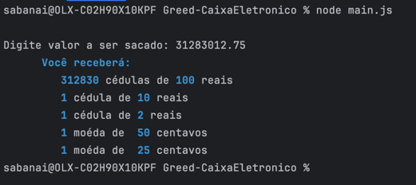
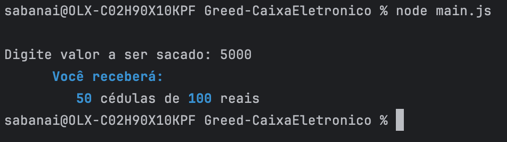
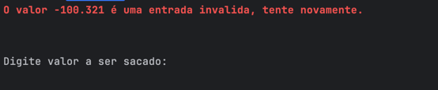

**!! Atenção: Renomeie o seu repositório para (Tema)_(NomeDoProjeto). !!**

Temas:
- Grafos1
- Grafos2
- PD
- D&C
- Greed
- Final

**!! *Não coloque os nomes dos alunos no título do repositório*. Exemplo de título correto: Grafos2_Labirinto-do-Minotauro !!**

(Apague essa seção)

# NomedoProjeto

**Número da Lista**: X 
**Conteúdo da Disciplina**: XXXXXXXXXX 

## Alunos
| Matrícula  | Aluno                    |
|------------|--------------------------|
| 21/1029586 | Sabrina Caldas Berno     |
| 19/0028122 | Gabriel Sabanai Trindade |

## Sobre
Este projeto simula um caixa eletrônico que permite ao usuário sacar dinheiro em cédulas e moedas. O objetivo do projeto é demonstrar a lógica de distribuição de dinheiro, convertendo um valor inserido pelo usuário em cédulas e moedas de diferentes denominações. O caixa eletrônico possui uma quantidade infinita de cédulas e moedas disponíveis.

As cédulas e moedas disponíveis são: 100, 50, 20, 10, 5, 2 reais, e 1 real, 50, 25, 10, 5, 1 centavos.

A ideia por tras do algoritmo é rodar um Interval Partitioning para simular um caixa eletronico. Dessa forma, colocamos o valor que queremos sacar e o programa vai nos mostrar quantas cedulas e moedas de cada valor deve ser retornado para igualar ao valor total do que queremos sacar.

## Screenshots

### Caso de sucesso com centavos

### Caso de sucesso sem centavos

### Caso de falha (entrada inválida)

## Instalação
**Linguagem**: Javascript 
Para rodar o projeto, é necessário que você tenha o node instalado na sua máquina

## Uso

Para usar o caixa eletrônico, siga os passos abaixo:

1. Clone o respositório:
   git clone https://github.com/projeto-de-algoritmos-2024/Grafos2-Labirinto

2. Navegue até o diretório do projeto:
   cd Grafos2-Labirinto

3. Execute o projeto:
   node main.js

## Outros
Quaisquer outras informações sobre seu projeto podem ser descritas abaixo.